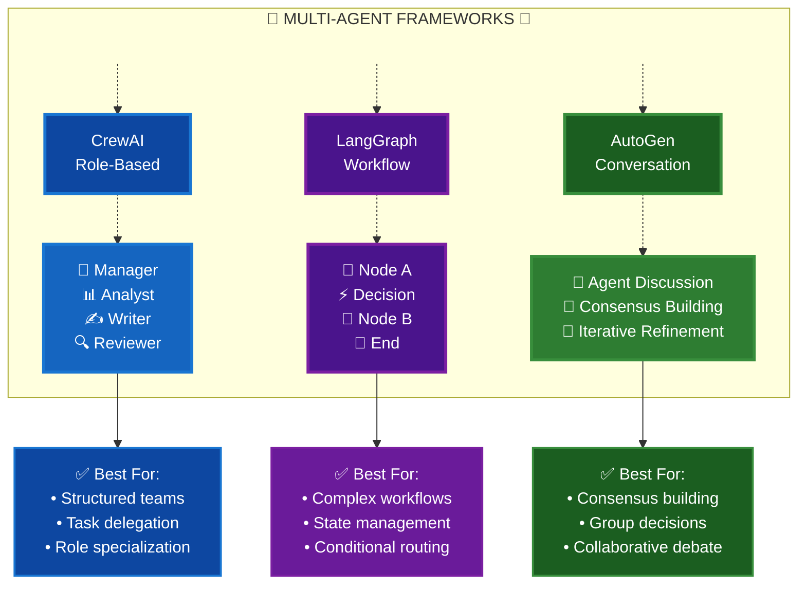
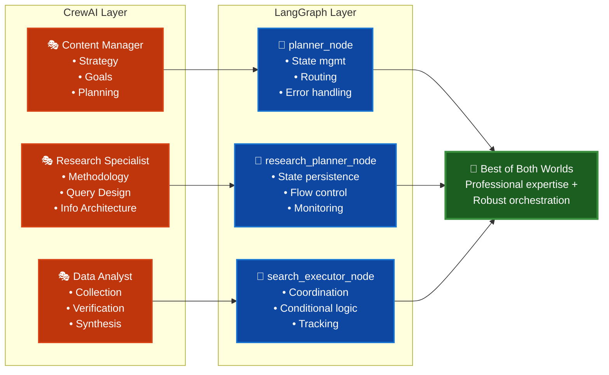
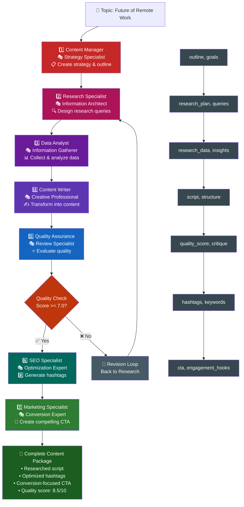
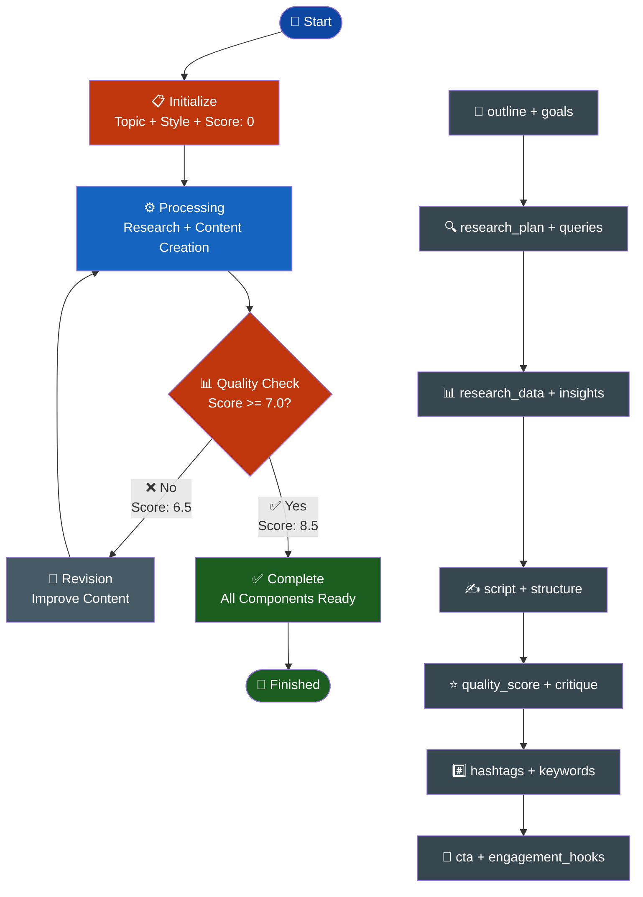
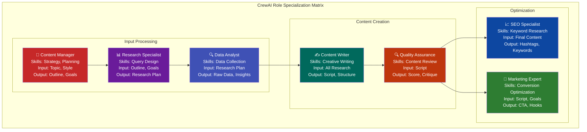
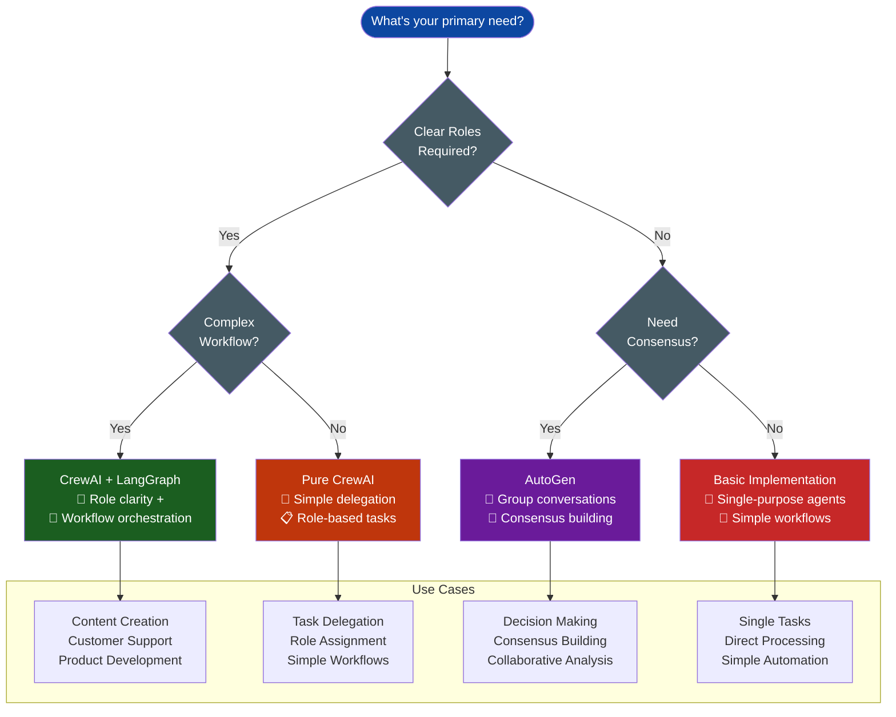
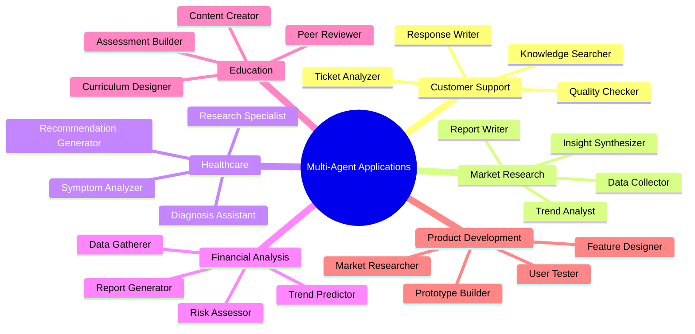

# Multi-Agent Systems with CrewAI + LangGraph
## Complete Visual Documentation for Interview Kickstart Demo

This comprehensive guide showcases the architecture and workflow of building sophisticated multi-agent systems using **CrewAI** for role-based agent specialization and **LangGraph** for workflow orchestration.

### 📋 Table of Contents
- [Multi-Agent Systems with CrewAI + LangGraph](#multi-agent-systems-with-crewai--langgraph)
  - [Complete Visual Documentation for Interview Kickstart Demo](#complete-visual-documentation-for-interview-kickstart-demo)
    - [📋 Table of Contents](#-table-of-contents)
    - [🎯 Key Benefits](#-key-benefits)
  - [1. Framework Comparison Overview](#1-framework-comparison-overview)
  - [2. CrewAI + LangGraph Integration Architecture](#2-crewai--langgraph-integration-architecture)
  - [3. Complete Content Creation Workflow](#3-complete-content-creation-workflow)
  - [4. State Management Flow](#4-state-management-flow)
  - [5. Agent Role Specialization Matrix](#5-agent-role-specialization-matrix)
  - [6. Framework Decision Tree](#6-framework-decision-tree)
  - [7. Real-World Application Patterns](#7-real-world-application-patterns)
  - [🚀 Getting Started](#-getting-started)
  - [📚 Additional Resources](#-additional-resources)

### 🎯 Key Benefits
- **Role Clarity**: Each agent has specialized responsibilities
- **Workflow Control**: Sophisticated state management and routing
- **Quality Assurance**: Built-in feedback and revision loops
- **Scalability**: Easy to extend with new agents and capabilities

---

## 1. Framework Comparison Overview

This diagram compares three major multi-agent frameworks, highlighting their unique strengths and best use cases. Understanding these differences is crucial for choosing the right approach for your project.

**Key Insights:**
- **CrewAI**: Excels at role-based task delegation with clear hierarchies
- **LangGraph**: Perfect for complex workflows requiring state management
- **AutoGen**: Ideal for consensus-building through agent conversations

---

## 2. CrewAI + LangGraph Integration Architecture

This architecture diagram demonstrates how CrewAI's role-based agents seamlessly integrate with LangGraph's workflow orchestration, creating a powerful hybrid approach.

**Integration Benefits:**
- **CrewAI Layer**: Provides professional expertise through specialized agent roles
- **LangGraph Layer**: Ensures robust workflow control and state management
- **Combined Power**: Best of both worlds for enterprise-grade multi-agent systems

---

## 3. Complete Content Creation Workflow

This comprehensive workflow shows our 7-agent content creation system in action, demonstrating how agents collaborate to produce high-quality content with built-in quality assurance.

**Workflow Highlights:**
- **Sequential Processing**: Each agent builds upon previous work
- **Quality Gates**: Automated quality checks with revision loops
- **State Management**: Complete data flow from topic to final output
- **Specialization**: Each agent focuses on their core expertise

---

## 4. State Management Flow

This diagram illustrates how LangGraph manages state throughout the content creation process, showing decision points and data flow patterns.

**State Management Features:**
- **Initialization**: Clean state setup with initial parameters
- **Processing Loop**: Main workflow execution with state persistence
- **Quality Control**: Automated decision making based on quality scores
- **Data Flow**: Complete state transformation from input to output

---

## 5. Agent Role Specialization Matrix

This matrix shows how our CrewAI agents are organized into logical groups with clear input/output relationships, demonstrating the power of role-based specialization.

**Specialization Groups:**
- **Input Processing**: Strategy, research planning, and data collection
- **Content Creation**: Writing and quality assurance
- **Optimization**: SEO and marketing enhancement

**Benefits:**
- Clear responsibilities and expertise boundaries
- Efficient workflow with minimal overlap
- Easy to scale and modify individual components

---

## 6. Framework Decision Tree

This decision tree helps you choose the right multi-agent framework based on your specific project requirements and constraints.

**Decision Factors:**
- **Role Clarity**: Do you need clearly defined agent roles?
- **Workflow Complexity**: How complex are your business processes?
- **Consensus Requirements**: Do agents need to collaborate on decisions?

**Framework Recommendations:**
- **CrewAI + LangGraph**: For complex, role-based systems
- **Pure CrewAI**: For simple delegation scenarios
- **AutoGen**: For collaborative decision-making
- **Basic Implementation**: For single-purpose automation

---

## 7. Real-World Application Patterns

This mind map showcases diverse real-world applications where multi-agent systems excel, demonstrating the versatility and practical value of this approach.

**Application Domains:**
- **Customer Support**: Automated ticket processing and response generation
- **Market Research**: Data collection, analysis, and insight synthesis
- **Healthcare**: Symptom analysis and treatment recommendations
- **Financial Analysis**: Risk assessment and trend prediction
- **Education**: Curriculum design and assessment creation
- **Product Development**: Market research and prototype building

**Common Patterns:**
- Specialized agents for domain expertise
- Coordinated workflows for complex tasks
- Quality assurance and validation steps
- Scalable architecture for growing needs

---

## 🚀 Getting Started

To implement these patterns in your own projects:

1. **Choose Your Framework**: Use the decision tree (Diagram 6) to select the best approach
2. **Define Agent Roles**: Create specialized agents with clear responsibilities
3. **Design Workflows**: Map out your process flow and decision points
4. **Implement State Management**: Use LangGraph for complex orchestration
5. **Add Quality Controls**: Build in feedback loops and validation steps

## 📚 Additional Resources

- **CrewAI Documentation**: [https://docs.crewai.com/](https://docs.crewai.com/)
- **LangGraph Guide**: [https://langchain-ai.github.io/langgraph/](https://langchain-ai.github.io/langgraph/)
- **AutoGen Framework**: [https://microsoft.github.io/autogen/](https://microsoft.github.io/autogen/)

---

*This documentation was created for the Interview Kickstart demo showcasing advanced multi-agent system architectures.*

