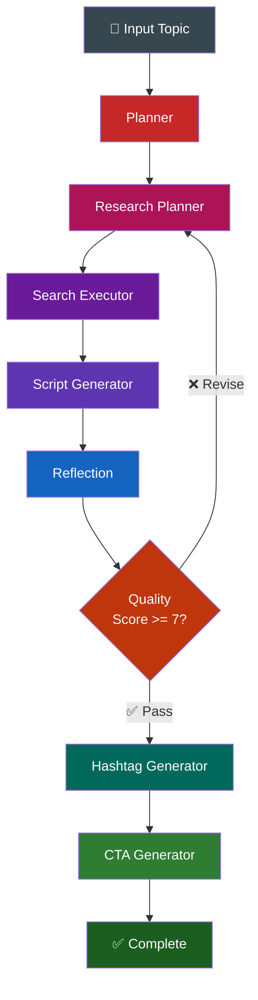

```mermaid
graph TD
    START[📝 Input Topic] --> PLANNER
    
    PLANNER[Planner] --> RESEARCH_P[Research Planner]
    RESEARCH_P --> SEARCH[Search Executor]
    SEARCH --> SCRIPT[Script Generator]
    
    SCRIPT --> REFLECTION[Reflection]
    
    REFLECTION --> DECISION{Quality<br/>Score >= 7?}
    
    DECISION -->|✅ Pass| HASHTAG[Hashtag Generator]
    DECISION -->|❌ Revise| RESEARCH_P
    
    HASHTAG --> CTA[CTA Generator]
    
    CTA --> FINAL[✅ Complete]
    
    style PLANNER fill:#c62828,color:#ffffff
    style RESEARCH_P fill:#ad1457,color:#ffffff
    style SEARCH fill:#6a1b9a,color:#ffffff
    style SCRIPT fill:#5e35b1,color:#ffffff
    style REFLECTION fill:#1565c0,color:#ffffff
    style HASHTAG fill:#00695c,color:#ffffff
    style CTA fill:#2e7d32,color:#ffffff
    style FINAL fill:#1b5e20,color:#ffffff
    style DECISION fill:#bf360c,color:#ffffff
    style START fill:#37474f,color:#ffffff
```

---
